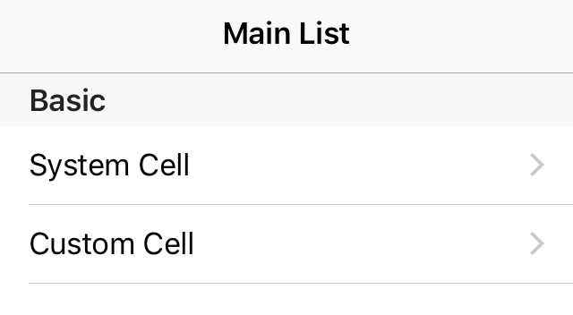

<p align="center">


</p>


 [](http://cocoapods.org/pods/MDTable)  [](https://developer.apple.com/iphone/index.action)
 [](https://developer.apple.com/swift)
 [](http://mit-license.org)

## MDTables

Are you tired of writing endless `UITableViewDataSource` and `UITableViewDelegate`?

MDTable is a **model driven framework**. Using MDTable, it is so easy to create tableView.

```
let row0_0 = SystemRow(title: "System Cell", accessoryType: .disclosureIndicator)
let row0_1 = SystemRow(title: "Custom Cell", accessoryType: .disclosureIndicator)
let section0 = SystemSection(rows: [row0_0]])
section0.titleForHeader = "Basic"
    
tableManager = TableManager(sections: [section0,section1])
tableView.md_bindTo(manager: tableManager!)
```

And your tableView is ready.




## Require

- Xcode 8.1+
- iOS 8.0+ 
- Swift 3.0+

## Communication

- If you **found a bug**, open an **issue**.
- If you have a **feature request**, open an **issue**.
- If you want to **contribute**, submit a **pull request**.


## Install

### CocoaPod

```
pod "MDTable"
```


## Useage

### Basic concept

Using MDTable, for each `tableView`, you need a `TableManger` to manage your sections and rows.

```
var tableManager:TableManager!
```

There are two protocol:`TableSection` and `TableRow` act as the model of section and row.

MDTable offers tow basic types:

- `SystemRow` - model of `UITableViewCell`.
- `SystemSection`- model of Section

```
let row1 = SystemRow(title: "Custom Color", rowHeight: 40.0, accessoryType: .detailDisclosureButton)
row1.onRender { (cell,isInital) in //Configure the style of UITableViewCell
    cell.textLabel?.textColor = UIColor.orange
    cell.textLabel?.font = UIFont.systemFont(ofSize: 14)
}.onDidSelected { (tableView, indexPath) in //Handle click event
    tableView.deselectRow(at: indexPath, animated: true)
}

let section = SystemSection(rows: [row1])
section.heightForHeader = 10.0
section.heightForFooter = 0.0
```

Then bind your `tableView` to `tableManager`, and your table is ready

```
tableManager = TableManager(sections: [section0])
tableView.md_bindTo(manager: tableManager)
```

### Custom Cell

#### Model

Create a type that conforms to `TableRow` to act as the Model of each Row.

```
import MDTable
class CustomXibRow: TableRow{
    //Protocol
    var rowHeight: CGFloat = 80.0
    var reuseIdentifier: String = "CustomXibRow"
    var initalType: TableRowInitalType = .(xibName: "CusomCellWithXib")
    // Add any event you want to handle
    var didSelectRowAt: (UITableView, IndexPath) -> Void
}
```

At least, you need these three propertys

- `rowHeight` height of the row. It can be a compute property so that you can get dynamic height.
- `reuseIdentifier` reuse identifier of the cell
- `initalType` how the cell is initally created. Either load from xib or create from class

#### Cell

Create a `SystemTableViewCell` subclass,and override `render`

```
class CusomCellWithXib: SystemTableViewCell{    
    override func render(with row: TableRow) {
        guard let row = row as? CustomXibRow else{
            return;
        }
 		 //Render the cell 
    }
}

```

#### Magic happens

```
let row = CustomXibRow()
let section = SystemSection(rows: row)
tableManager = TableManager(sections: [section])
tableView.md_bindTo(manager: tableManager)

```

## Author

Leo, leomobiledeveloper@gmail.com

## License

MDTable is available under the MIT license. See the LICENSE file for more info.
